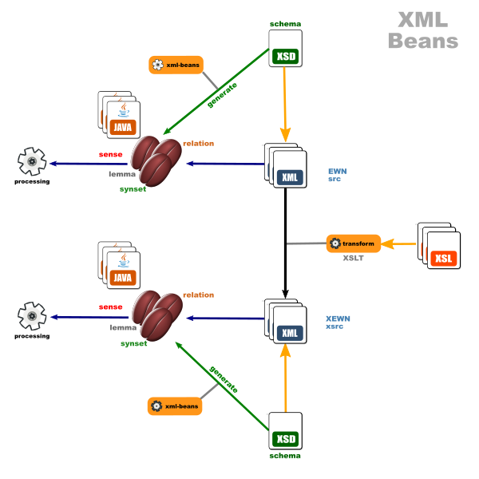

### XML Beans for XEWN XML schema

Provides access to Xtended English Wordnet (XEWN) *xsrc* files through Plain Old Java Object (Pojo) classes or '*beans*'. The Java objects are generated from the XSD typed schema by the XML Beans compiler. Selection of objects at runtime is done with **XPath** syntax.

It uses the **Apache's XML Beans** framework and includes a Saxon runtime to implement XPath queries.

Please refer to the test classes in the source files to get a glimpse as to how it can be used.

GroupID and ArtifactID on Maven Central:

	<groupId>io.github.x-englishwordnet</groupId>
	<artifactId>xewn-beans</artifactId>
	<version>1.0.1</version>
	<name>XEWN Beans</name>